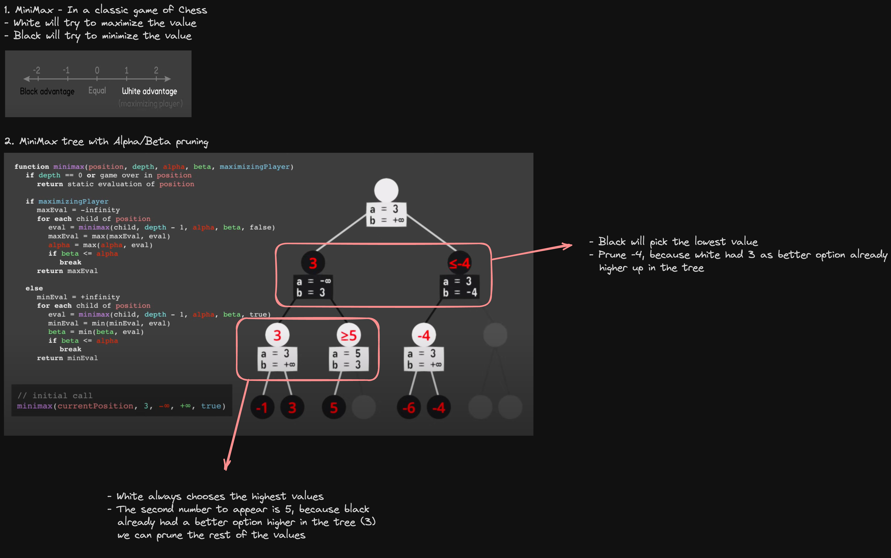

# Harvard CS50 AI - Lecture 0 - Search

Depth First Search (StackFrontier)

A depth-first search algorithm exhausts each one direction before trying another direction. In these cases, the frontier is managed as a stack data structure. The catchphrase you need to remember here is **“last-in first-out.”** After nodes are being added to the frontier, the first node to remove and consider is the last one to be added. This results in a search algorithm that goes as deep as possible in the first direction that gets in its way while leaving all other directions for later.

_(An example from outside lecture: Take a situation where you are looking for your keys. In a depth-first search approach, if you choose to start with searching in your pants, you’d first go through every single pocket, emptying each pocket and going through the contents carefully. You will stop searching in your pants and start searching elsewhere only once you will have completely exhausted the search in every single pocket of your pants.)_

**Pros:**

- At best, this algorithm is the fastest. If it “lucks out” and always chooses the right path to the solution (by chance), then depth-first search takes the least possible time to get to a solution.

**Cons:**

- It is possible that the found solution is not optimal.
- At worst, this algorithm will explore every possible path before finding the solution, thus taking the longest possible time before reaching the solution.

Breadth-First Search (QueueFrontier)

The opposite of depth-first search would be breadth-first search (BFS).

A breadth-first search algorithm will follow multiple directions at the same time, taking one step in each possible direction before taking the second step in each direction. In this case, the frontier is managed as a queue data structure. The catchphrase you need to remember here is **“first-in first-out.”** In this case, all the new nodes add up in line, and nodes are being considered based on which one was added first (first come first served!). This results in a search algorithm that takes one step in each possible direction before taking a second step in any one direction.

_(An example from outside lecture: suppose you are in a situation where you are looking for your keys. In this case, if you start with your pants, you will look in your right pocket. After this, instead of looking at your left pocket, you will take a look in one drawer. Then on the table. And so on, in every location you can think of. Only after you will have exhausted all the locations will you go back to your pants and search in the next pocket.)_

**Pros:**

- This algorithm is guaranteed to find the optimal solution.

**Cons:**

- This algorithm is almost guaranteed to take longer than the minimal time to run.
- At worst, this algorithm takes the longest possible time to run.

Greedy Best-First Search

Breadth-first and depth-first are both uninformed search algorithms. That is, these algorithms do not utilize any knowledge about the problem that they did not acquire through their own exploration. However, most often is the case that some knowledge about the problem is, in fact, available. For example, when a human maze-solver enters a junction, the human can see which way goes in the general direction of the solution and which way does not. AI can do the same. A type of algorithm that considers additional knowledge to try to improve its performance is called an informed search algorithm.

Greedy best-first search expands the node that is the closest to the goal, as determined by a heuristic function h(n). As its name suggests, the function estimates how close to the goal the next node is, but it can be mistaken. The efficiency of the greedy best-first algorithm depends on how good the heuristic function is. For example, in a maze, an algorithm can use a heuristic function that relies on the Manhattan distance between the possible nodes and the end of the maze. The Manhattan distance ignores walls and counts how many steps up, down, or to the sides it would take to get from one location to the goal location. This is an easy estimation that can be derived based on the (x, y) coordinates of the current location and the goal location.

_However, it is important to emphasize that, as with any heuristic, it can go wrong and lead the algorithm down a slower path than it would have gone otherwise. It is possible that an uninformed search algorithm will provide a better solution faster, but it is less likely to do so than an informed algorithm._

A\* Search

A development of the greedy best-first algorithm, A\* search considers not only `h(n)`, the estimated cost from the current location to the goal, but also `g(n)`, the cost that was accrued until the current location. By combining both these values, the algorithm has a more accurate way of determining the cost of the solution and optimizing its choices on the go. The algorithm keeps track of (cost of path until now + estimated cost to the goal), and once it exceeds the estimated cost of some previous option, the algorithm will ditch the current path and go back to the previous option, thus preventing itself from going down a long, inefficient path that `h(n)` erroneously marked as best.

Yet again, since this algorithm, too, relies on a heuristic, it is as good as the heuristic that it employs. It is possible that in some situations it will be less efficient than greedy best-first search or even the uninformed algorithms. For A\* search to be optimal, the heuristic function, `h(n)`, should be:

1. Admissible, or never overestimating the true cost, and
2. Consistent, which means that the estimated path cost to the goal of a new node in addition to the cost of transitioning to it from the previous node is greater or equal to the estimated path cost to the goal of the previous node. To put it in an equation form, `h(n)` is consistent if for every node n and successor node n’ with step cost `c`, `h(n) ≤ h(n’) + c`.

Minimax

This is the best explanation of a minimax algorithm I could find:
[https://www.youtube.com/watch?v=l-hh51ncgDI](https://www.youtube.com/watch?v=l-hh51ncgDI)

A small summary of the whole concept captured in this image

